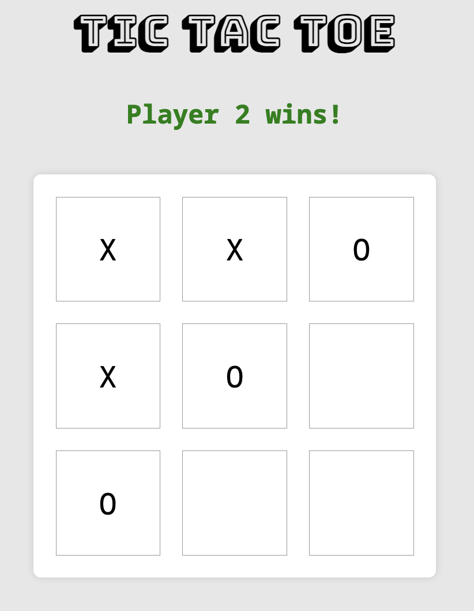

# Tic Tac Toe
#### [🔗 Play Now!](https://carisaelam-tic-tac-toe.netlify.app)

This is a browser-based Tic Tac Toe game built with JavaScript. The game allows two players to compete against each other, and the interface provides options to start/restart the game and view the results.

## Features
- Two-player Tic Tac Toe game
- Interactive gameboard rendered on the webpage
- Game logic to check for winning combinations and ties
- Option to restart the game
- Player name input for a personalized experience

## Technologies Used
- HTML
- CSS
- JavaScript (Object-oriented programming with module patterns)

## How to Play
1. Open the game in your browser and click "Start"
2. Enter player names, otherwise values default to "Player 1" and "Player 2"
3. Players take turns clicking on the board to place their marks (X or O).
4. The game will declare a winner when a player achieves three marks in a row, or a tie if all spots are filled without a win.
5. Click "Clear" to restart the current game or "New Game" to start over with new players. 

**Visit the live site at: https://carisaelam-tic-tac-toe.netlify.app**

